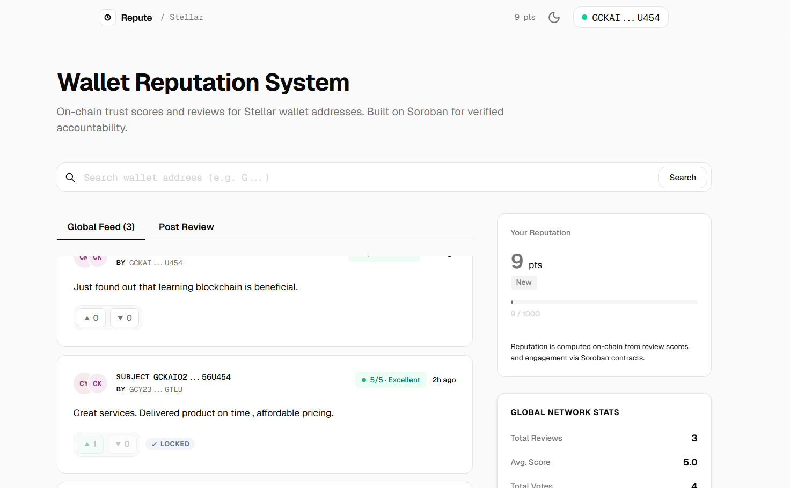
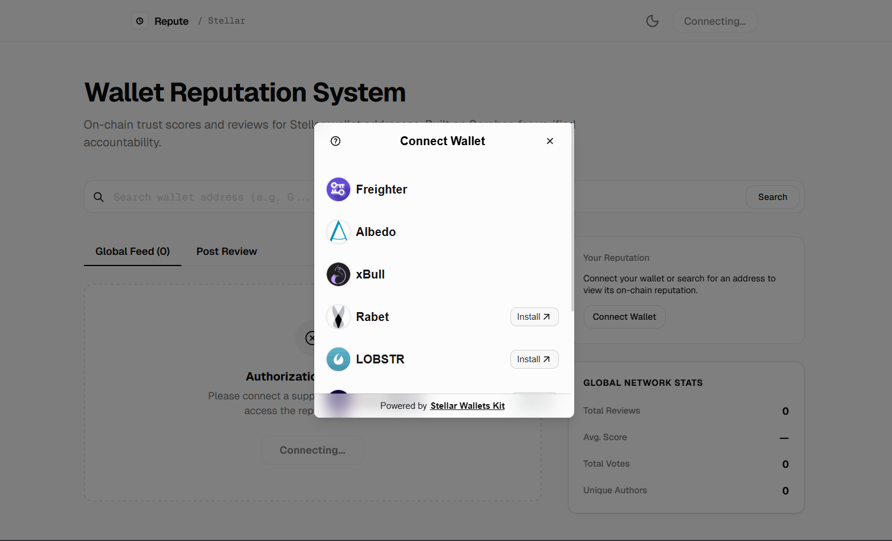
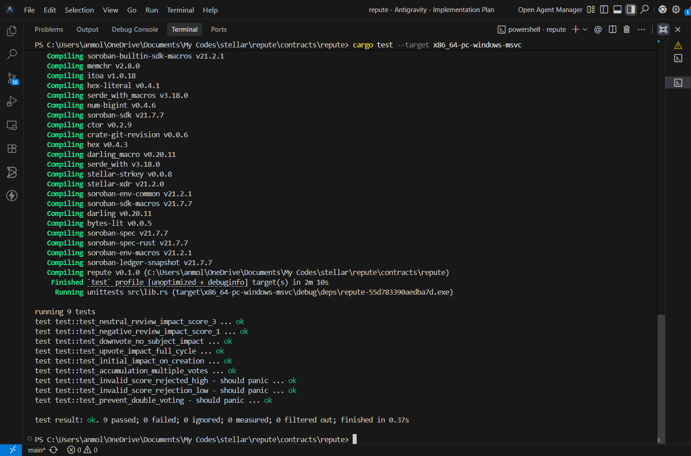

# Repute: On-Chain Wallet Reputation System

**Repute** is a decentralized reputation protocol built on the **Stellar Testnet** using **Soroban** smart contracts. It allows users to review Stellar wallet addresses, providing an on-chain "trust score" based on community-verified interactions.


## 🚀 Live Proof (Testnet)

- **Contract ID**: `CDCVEDFOEHVDBYINQXAG3HRINEJH77WK67HX23C6BHRL5SAEC7I7X37L`
- **Network Passphrase**: `Test SDF Network ; September 2015`
- **RPC URL**: `https://soroban-testnet.stellar.org`

## 🎥 Demo
[Watch the Repute Demo on YouTube](https://www.youtube.com/watch?v=txEMhr55mj0) ;
[Presentation explaining app functionality](https://docs.google.com/presentation/d/17f1GCm_TyX1w5-_OiR8ffEw0Kqdn-a-K/edit?usp=sharing&ouid=115809135976796745965&rtpof=true&sd=true)

---

## 📸 Screenshots

| Dashboard Feed | Wallet Connection |
| :---: | :---: |
|  |  |

---

## ✨ Features

### 🔐 Multi-Wallet Support
Powered by the **Stellar Wallets Kit**, Repute supports a wide range of browser extensions:
- **Freighter** (Default)
- **xBull**
- **Albedo**
- **Hana**
- **Lobstr**

### 📊 Reputation Logic
Scores and reputations are calculated on-chain using a transparent impact formula:
- **Initial Impact**: `impact = (score - 3)`. 
  - Score 5 = +2 reputation
  - Score 3 = 0 reputation
  - Score 1 = -2 reputation
- **Upvote (AGREE)**:
  - Subject's reputation increases by the review's `impact` again.
  - Author's reputation increases by **+1** (reward for accurate reporting).
- **Downvote (DISAGREE)**:
  - Author's reputation decreases by **-1** (penalty for a misleading review).
  - Subject's reputation remains unchanged (protection against malicious attacks).

### 🎨 Premium UI/UX
- **Interactive Feed**: Real-time review filtering and global reputation tracking.
- **Glassmorphism Design**: Modern aesthetic with a focus on usability.
- **Dark Mode Support**: Seamless theme switching with persistent preferences.
- **Responsive Layout**: Sticky sidebars and independent scroll zones for the main feed.

---

## 🛠️ Tech Stack

- **Frontend**: Next.js 16.2.2 (App Router), Tailwind CSS v4, Lucide Icons.
- **SDKs**: `@stellar/stellar-sdk`, `@creit-tech/stellar-wallets-kit`.
- **Smart Contract**: Rust (Soroban SDK).

---

## 📂 Project Structure

```text
repute/
├── app/                # Next.js App Router (Pages & Layouts)
├── components/         # Reusable React UI Components
├── contracts/
│   └── repute/         # Soroban Smart Contract (Rust)
│       ├── src/        # Contract logic & Unit Tests
│       └── Cargo.toml  # Rust dependencies
├── lib/
│   ├── wallet.js       # Stellar Wallets Kit Integration
│   └── contract.js     # Soroban RPC & Transaction Logic
├── public/             # Static Assets & Icons
├── .env                # Environment Configuration
└── README.md           # Project Documentation
```

---

## 🏗️ Getting Started

### Prerequisites
- Node.js 18+
- [Stellar Wallet Extension](https://www.stellar.org/freighter/)

### Local Installation

1. **Clone the repository**:
   ```bash
   git clone https://github.com/Anmol-345/repute.git
   cd repute
   ```

2. **Install dependencies**:
   ```bash
   npm install
   ```

3. **Configure Environment**:
   Create a `.env` file in the root (matching the provided proof above):
   ```env
   NEXT_PUBLIC_STELLAR_NETWORK=TESTNET
   NEXT_PUBLIC_SOROBAN_RPC_URL=https://soroban-testnet.stellar.org
   NEXT_PUBLIC_HORIZON_URL=https://horizon-testnet.stellar.org
   NEXT_PUBLIC_SOROBAN_CONTRACT_ID=CDCVEDFOEHVDBYINQXAG3HRINEJH77WK67HX23C6BHRL5SAEC7I7X37L
   NEXT_PUBLIC_NETWORK_PASSPHRASE="Test SDF Network ; September 2015"
   ```

4. **Run the development server**:
   ```bash
   npm run dev
   ```

### Running Smart Contract Tests

To verify the reputation logic, navigate to the contract directory and run Rust unit tests:
```bash
cd contracts/repute
cargo test --target x86_64-pc-windows-msvc
```

### Verified Test Results


```bash
running 9 tests
test test::test_neutral_review_impact_score_3 ... ok
test test::test_negative_review_impact_score_1 ... ok
test test::test_downvote_no_subject_impact ... ok
test test::test_upvote_impact_full_cycle ... ok
test test::test_initial_impact_on_creation ... ok
test test::test_accumulation_multiple_votes ... ok
test test::test_invalid_score_rejected_high - should panic ... ok
test test::test_invalid_score_rejection_low - should panic ... ok
test test::test_prevent_double_voting - should panic ... ok

test result: ok. 9 passed; 0 failed; 0 ignored; 0 measured; 0 filtered out; finished in 0.37s
```

---

## 📄 License
This project is open-source under the MIT License.
